<<<<<<< HEAD
<h1 align="center">Developer xerve = new Developer("javi")</h1>

###

My name is Javier and I'm a software development student, from Madrid, Spain

###

<h2 align="center">About me</h2>

###

✨ Creating bugs since 2005 🎯 Goals: Make something great 🏎️ Fun fact: I love Formula 1 (Fernando Alonso's fan)

###

<h2 align="center">I code in</h2>

###

 

  
  
  
  
  
  
  
  
  

###

<h2 align="center">Tools that I use</h2>

###

 

  
  
  
  
  
  
  
  
  
  
  
  
  
  
  
  
  
  

###
=======
<!--
  This is your PROFILE README. It goes in a repo named exactly after your
  username (e.g. github.com/OCTOCAT/OCTOCAT) so GitHub shows it on your profile.
  Replace the ALL-CAPS placeholders. Widths 370/490 keep the portrait and info
  card the same height -- if you change the info card's H, re-match these.
-->

<table>
<tr>
<td valign="top"></td>
<td valign="top"></td>
</tr>
</table>

## Javi · devxerve

**Full-Stack Developer · Computer Engineering Student · Multiplatform App Development**

[LinkedIn](https://img.shields.io/badge/LinkedIn-YOURHANDLE-0A66C2?style=for-the-badge&logo=linkedin&logoColor=white)](https://www.linkedin.com/in/javiercerverar)

 

<!-- animated contribution graph, refreshed daily by the workflow -->

>>>>>>> 4166acc (profile art)
